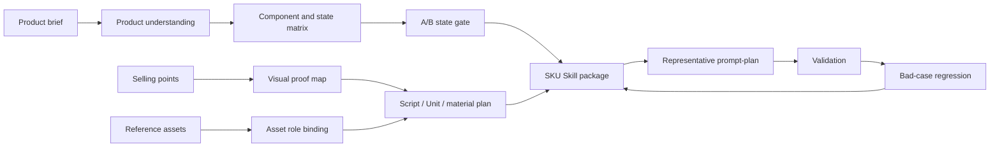

# Ecommerce SKU Skill Builder

[](https://github.com/HXZ09845/ecommerce-sku-skill-builder/actions/workflows/validate.yml)
[](CHANGELOG.md)
[](LICENSE)
[](skills/sku-skill-builder/SKILL.md)

**Turn ecommerce product briefs, selling points, reference assets, and case videos into validated SKU-specific AI video-generation Skill packages.**

English · [中文](README.zh.md)

电商 AIGC 短视频不应该从“写 prompt”开始。稳定的商品视频生产要先做商品结构理解、卖点视觉证明、素材角色绑定、A/B 状态判断、脚本-Unit-素材编排、验证和 bad-case 回归。This repository packages that workflow as a Codex-compatible Agent Skill.


## Why Star This

- You build AI video workflows for ecommerce products.
- You want a real Agent Skill package structure, not just prompt examples.
- You need a repeatable way to convert product briefs and reference assets into prompt plans.
- You care about validation, bad-case regression, and handoff-ready Skill packages.
- You want to see how a real production prompt-plan gets compiled into safer shot contracts.

## The Problem

Most ecommerce AI video workflows fail because they jump from copywriting directly to prompt writing.

| Common failure | What this Skill adds |
|---|---|
| Prompt starts before the product is understood | Product understanding card and component/state matrix |
| Selling points are decorative, not visually proven | One-by-one selling-point proof mapping |
| Reference images and videos contaminate each other | Explicit `controls` / `does_not_control` asset roles |
| Product states conflict across clips | A/B, A-out, A-in, B, and A+B classification |
| Generated videos fail, but lessons disappear | Bad-case regression into rules, gotchas, and validators |
| A new operator cannot reproduce expert decisions | Fixed source confirmation, intake, and validation workflow |

## What This Is

This project contains a publishable Agent Skill named [`sku-skill-builder`](skills/sku-skill-builder/SKILL.md).

It helps an AI coding agent create or update concrete product SKU Skills for ecommerce AIGC short-video workflows. The output target is a self-contained skill package with:

- `SKILL.md`
- `agents/openai.yaml`
- `references/`
- `scripts/`
- optional `assets/`
- representative prompt plans and validation hooks

It is not a video model, API wrapper, SaaS product, or prompt-template dump. It is a workflow Skill for building SKU-specific production Skills.

## How It Works



## Before / After

| Before: ordinary prompt workflow | After: SKU Skill workflow |
|---|---|
| "Make a premium product video for this product." | Product identity, state, target user, scene, and proof target are separated first. |
| "Use this video as reference." | The video controls motion/rhythm only; it must not control product identity or background unless approved. |
| "Show the product is convenient." | The selling point maps to a concrete visual proof, Unit, product state, materials, and downgrade route. |
| "Fix the prompt, it failed." | The failure is routed to root cause, one repair variable, validator rule, or gotcha. |

See [`examples/`](examples/) for a fictional product walkthrough.

## Complete Chinese Walkthrough

If you want to understand the project quickly, start here:

[`examples/complete-chinese-case.md`](examples/complete-chinese-case.md)

It shows a full fictional ecommerce video case in Chinese:

- original product brief, selling points, and reference material arrangement;
- source confirmation and product understanding;
- component/state matrix and A/B decision;
- before/after prompt comparison;
- Seedance-style executable shot prompts;
- human review gates and failure repair rules.

## Real Run Case Study

The repository also includes an anonymized real production run:

[`case-studies/real-run-a6-office-tea-bar/`](case-studies/real-run-a6-office-tea-bar/)

This case is derived from a real ecommerce video prompt-plan workflow. Product brand names, raw media files, asset IDs, and unpublished generated videos are intentionally not included. The public case keeps the useful engineering evidence: Unit schedule, A/B decisions, asset role boundaries, before/after prompt changes, take-review rules, and what was learned from the run.

## Source Registry

Public evidence is tracked in [`data/source-registry.json`](data/source-registry.json) and explained in [`docs/source-registry.md`](docs/source-registry.md).

Run:

```bash
python3 scripts/source_registry_check.py
```

## Typical Inputs

- Product brief.
- Selling-point table.
- Case video or real-shot reference material.
- Existing prompt plans or old SKU packages.
- Approved or pending asset manifest.
- Target platform, aspect ratio, model, duration, and compliance constraints.

## Typical Outputs

- Source confirmation card.
- Product understanding card.
- Component/state matrix.
- Selling-point to visual-proof map.
- Script/Unit/material arrangement.
- Standard SKU Skill package draft.
- Representative prompt-plan.
- Product-specific validator.
- Bad-case regression notes.

## Quick Start

Install the packaged Skill:

```bash
python3 scripts/install_codex_skill.py
```

Or copy the skill folder manually:

```bash
mkdir -p ~/.codex/skills
cp -R skills/sku-skill-builder ~/.codex/skills/sku-skill-builder
```

Restart Codex, then invoke:

```text
$sku-skill-builder
```

Example request:

```text
Use $sku-skill-builder to create a SKU Skill for a foldable desktop humidifier.
I have a product brief, four selling points, and a few reference images.
Start with source confirmation and product understanding only.
```

You can test the installer without writing files:

```bash
python3 scripts/install_codex_skill.py --dry-run
```

## Repository Layout

```text
ecommerce-sku-skill-builder/
├── README.md
├── README.zh.md
├── assets/
│   └── workflow-hero.png
├── case-studies/
│   └── real-run-a6-office-tea-bar/
│       └── office-tea-bar-overtime-sku/
├── docs/
│   ├── architecture.md
│   ├── launch-playbook.md
│   ├── roadmap.md
│   └── why-sku-skills.md
├── examples/
│   ├── complete-chinese-case.md
│   ├── demo-product-brief.md
│   ├── demo-selling-point-map.md
│   ├── demo-prompt-plan.md
│   └── before-after.md
├── scripts/
│   ├── install_codex_skill.py
│   └── validate_release.py
└── skills/
    └── sku-skill-builder/
        ├── SKILL.md
        ├── agents/openai.yaml
        ├── references/
        └── scripts/
```

## Core References

| File | Purpose |
|---|---|
| [`product-rules.md`](skills/sku-skill-builder/references/product-rules.md) | Industry-general product/state/A-B rules |
| [`sku-creator-workflow.md`](skills/sku-skill-builder/references/sku-creator-workflow.md) | Staged creation workflow |
| [`audio-visual-sync.md`](skills/sku-skill-builder/references/audio-visual-sync.md) | Script to Unit to material alignment |
| [`prompt-plan-format.md`](skills/sku-skill-builder/references/prompt-plan-format.md) | Representative prompt-plan contract |
| [`gotchas.md`](skills/sku-skill-builder/references/gotchas.md) | Repeatable failure patterns and prevention |
| [`validate-template.py`](skills/sku-skill-builder/references/validate-template.py) | Product-specific validator starter |

## Validation

Run the release check:

```bash
python3 scripts/validate_release.py
```

Run prompt-plan checks:

```bash
python3 scripts/prompt_plan_check.py --evals evals/prompt-plan-evals.json
python3 -m unittest discover -s tests -v
```

The validators check the public release shape, skill frontmatter, required references, examples, prompt-plan structure, reference role contracts, clip scopes, `Stop when` endpoints, and common private-path or credential leaks.

## Schemas And Evals

| File | Purpose |
|---|---|
| [`schemas/prompt-plan.schema.json`](schemas/prompt-plan.schema.json) | Structured prompt-plan contract |
| [`schemas/asset-manifest.schema.json`](schemas/asset-manifest.schema.json) | Asset role and approval contract |
| [`schemas/take-review.schema.json`](schemas/take-review.schema.json) | Generated-take review contract |
| [`schemas/source-registry.schema.json`](schemas/source-registry.schema.json) | Public source and privacy-boundary contract |
| [`evals/prompt-plan-evals.json`](evals/prompt-plan-evals.json) | Prompt-plan validation cases |
| [`scripts/prompt_plan_check.py`](scripts/prompt_plan_check.py) | Markdown prompt-plan checker |
| [`scripts/source_registry_check.py`](scripts/source_registry_check.py) | Source provenance and privacy-boundary checker |
| [`examples/demo-asset-manifest.json`](examples/demo-asset-manifest.json) | Example asset manifest |
| [`examples/demo-take-review.json`](examples/demo-take-review.json) | Example generated-take review |
| [`scripts/structured_data_check.py`](scripts/structured_data_check.py) | JSON example checker |

## Learn More

- [Why SKU Skills?](docs/why-sku-skills.md)
- [Architecture](docs/architecture.md)
- [Launch Playbook](docs/launch-playbook.md)
- [Roadmap](docs/roadmap.md)
- [Contributing](CONTRIBUTING.md)

## License

MIT
