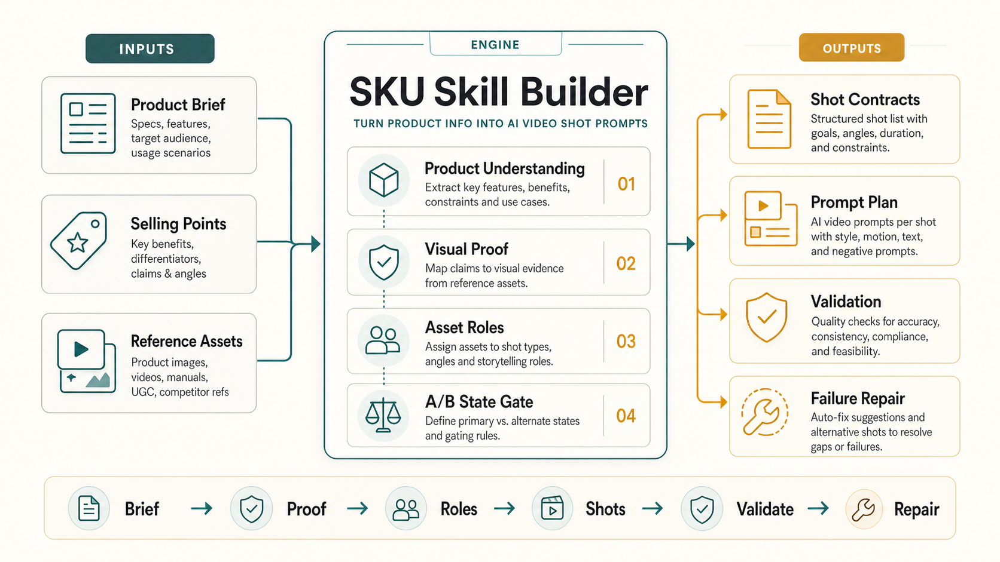

# Ecommerce SKU Skill Builder 中文说明

[](https://github.com/HXZ09845/ecommerce-sku-skill-builder/actions/workflows/validate.yml)
[](CHANGELOG.md)
[](LICENSE)

English · [中文](README.zh.md)

**把电商商品 Brief、卖点、素材编排和案例视频，转成可验证、可复用、可交接的 SKU 视频生成 Skill 包。**

这个项目不是一个视频生成 API，也不是一堆 prompt 模板。它是一个 Codex / Agent Skill 工作流，用来帮助团队把“已经判断好的商品卖点和素材”稳定翻译成 AI 视频模型更容易执行的镜头任务。



## 解决什么问题

电商带货视频最容易失败的地方，不是不会写漂亮词，而是生产判断没有被拆开：

| 常见问题 | 这个项目补上的机制 |
|---|---|
| 商品还没理解清楚就开始写 prompt | 先做商品理解卡、组件/状态矩阵 |
| 卖点只有口号，没有画面证明 | 每个卖点绑定 visual proof |
| 素材之间互相污染 | 每个素材写清 `controls` / `does_not_control` |
| 多段视频续写靠手感 | 用 Unit、reserved beats、Stop when 管理多段 |
| 失败以后只会继续改词 | 用 take-review 归因，再写回 gotchas / validator |
| 经验在个人脑子里 | 输出成可交接的 SKU Skill 包 |

## 适合谁

- 做电商 AIGC 带货视频的人。
- 已经有商品卖点、素材编排、案例视频，但生成不稳定的团队。
- 想把个人 prompt 经验沉淀成 Agent Skill 的人。
- 想学习 Codex Skill 工程化结构的人。

## 输入是什么

你通常需要准备：

- 商品 Brief。
- 卖点表。
- 实拍商品图、细节图、场景图、动作视频。
- 已经写过的 prompt-plan 或脚本素材编排。
- 目标平台、视频比例、时长、模型和风险约束。

## 输出是什么

这个 Skill 会引导 agent 产出：

- 读取确认卡。
- 商品理解卡。
- 组件/状态矩阵。
- 卖点到视觉证明映射。
- 素材角色表。
- A/B 状态判断。
- Script / Unit / material 编排。
- Seedance-style 镜头 prompt。
- 产品专属 validator。
- 失败修复和 bad-case 回归规则。

## 快速安装

运行安装脚本：

```bash
python3 scripts/install_codex_skill.py
```

或者手动复制：

```bash
mkdir -p ~/.codex/skills
cp -R skills/sku-skill-builder ~/.codex/skills/sku-skill-builder
```

重启 Codex 后调用：

```text
$sku-skill-builder
```

你也可以先 dry-run：

```bash
python3 scripts/install_codex_skill.py --dry-run
```

## 推荐使用方式

```text
使用 $sku-skill-builder，帮我把这个商品做成一个 SKU Skill。
我有商品 Brief、4 个卖点、素材编排和一个参考视频。
先不要直接写最终 prompt，先做读取确认、商品理解和卖点证明路径。
```

## 真实案例

仓库里有一个脱敏真实运行案例：

[`case-studies/real-run-a6-office-tea-bar/`](case-studies/real-run-a6-office-tea-bar/)

这个案例来自真实电商视频 prompt-plan 工作流。公开版不包含品牌名、真实素材文件、asset id、未发布生成视频，但保留了真正有价值的工程证据：

- Unit 排期。
- A/B 类型。
- 素材角色边界。
- 前后 prompt 对比。
- take-review 失败归因。
- 可写回 SKU Skill 的规则。
- 最终输出 SKU Skill 包样例。

## 完整中文 walkthrough

如果第一次看这个项目，建议先看：

[`examples/complete-chinese-case.md`](examples/complete-chinese-case.md)

它用一个虚构桌面加湿器案例说明：

- 原始商品 Brief 和卖点怎么输入。
- 普通 prompt 为什么不稳定。
- Skill 中间补了哪些判断。
- 改写后的镜头 prompt 长什么样。
- 人在流程里应该确认什么。

## 项目结构

```text
ecommerce-sku-skill-builder/
├── README.md
├── README.zh.md
├── assets/
│   └── workflow-hero.png
├── case-studies/
│   └── real-run-a6-office-tea-bar/
│       └── office-tea-bar-overtime-sku/
├── examples/
├── docs/
├── scripts/
│   ├── install_codex_skill.py
│   └── validate_release.py
└── skills/
    └── sku-skill-builder/
```

## 校验

```bash
python3 scripts/validate_release.py
python3 case-studies/real-run-a6-office-tea-bar/office-tea-bar-overtime-sku/scripts/validate_case.py \
  case-studies/real-run-a6-office-tea-bar/office-tea-bar-overtime-sku/references/prompt-plan.md
```

## 核心定位

最准确的一句话：

> 这个项目把电商商品视频的“业务判断、素材角色、卖点证明、镜头 prompt、失败修复”做成一个可复用的 Agent Skill 工程机制。
