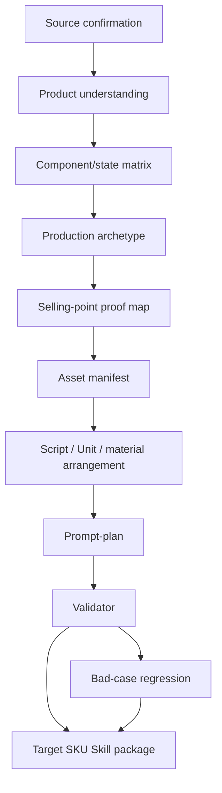

# Architecture

This repository has two layers:

1. The GitHub project layer.
2. The Agent Skill package layer.

## GitHub Project Layer

```text
README.md
docs/
examples/
scripts/validate_release.py
.github/workflows/validate.yml
```

This layer is for humans: installation, explanation, examples, launch materials, and CI.

## Agent Skill Package Layer

```text
skills/sku-skill-builder/
├── SKILL.md
├── agents/openai.yaml
├── references/
└── scripts/
```

This layer is what an agent loads.

`SKILL.md` is the entrypoint. It should stay focused on activation, routing, and critical workflow gates. Dense rules live in `references/` so the agent can load them progressively.

## Progressive Disclosure

The skill follows a progressive disclosure pattern:

```text
Skill metadata -> SKILL.md -> relevant references -> scripts/templates -> concrete SKU package
```

This avoids loading every rule at once while still keeping the package self-contained.

## Core Workflow



## Self-Contained Handoff Rule

Generated SKU Skills should not depend on this creator package at runtime.

Every target SKU Skill should include its own:

- `SKILL.md`;
- `references/`;
- `scripts/validate_*.py`;
- asset manifest or pending asset table;
- gotchas and trigger tests;
- representative prompt-plan.

